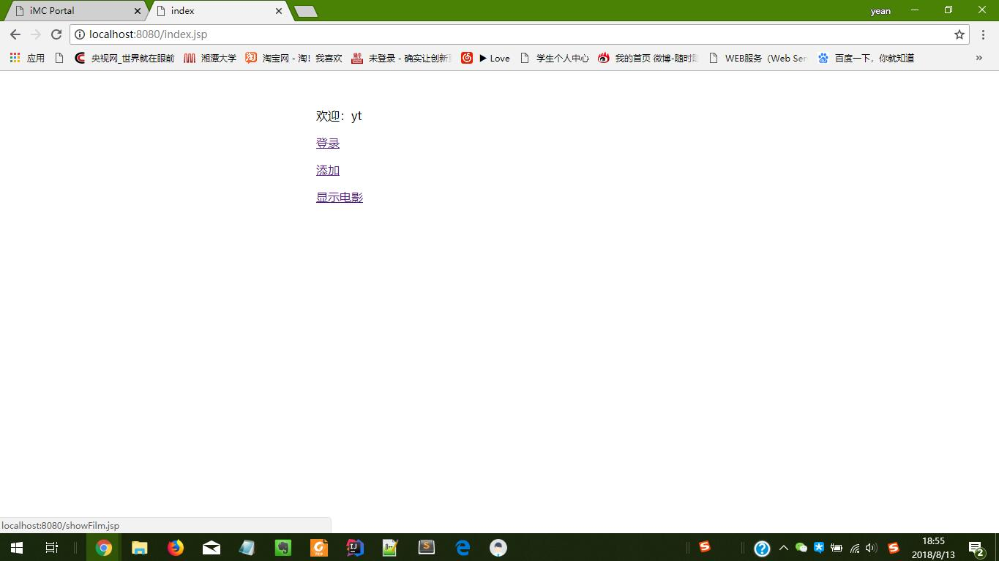
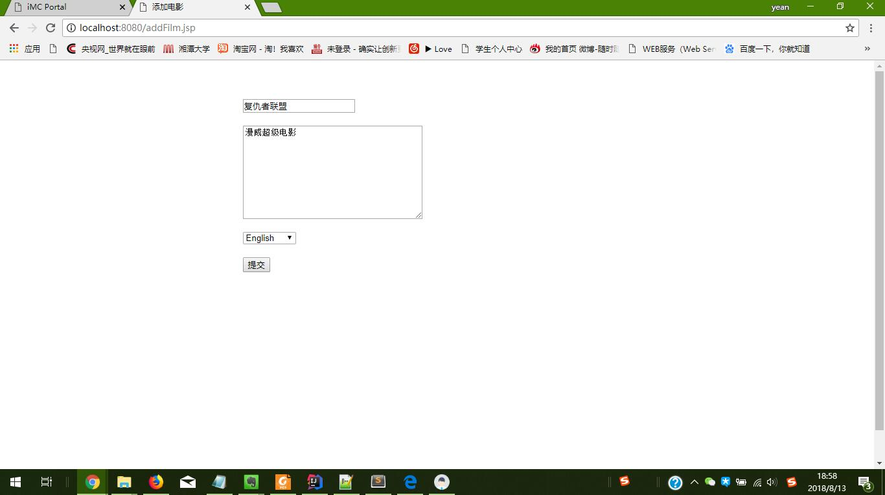
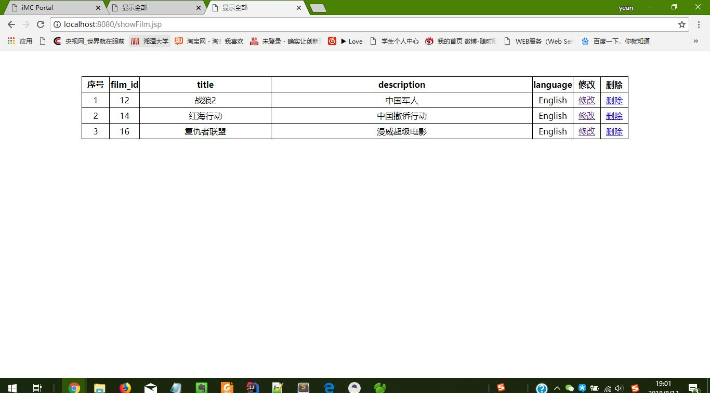
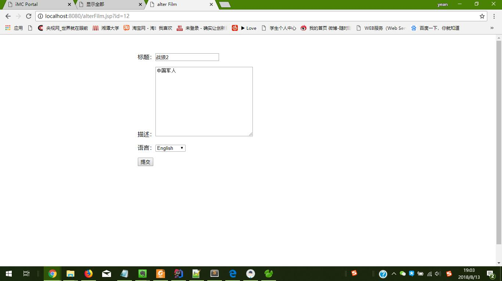
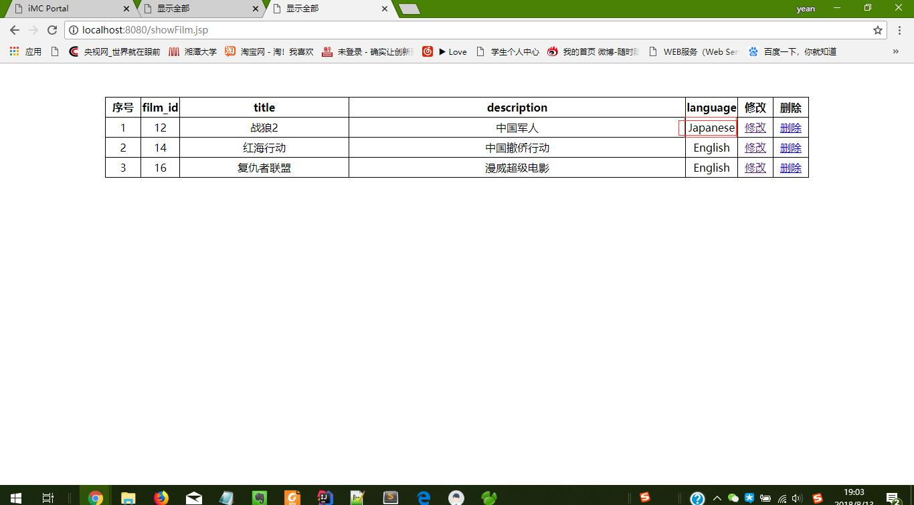
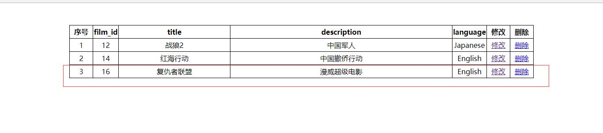
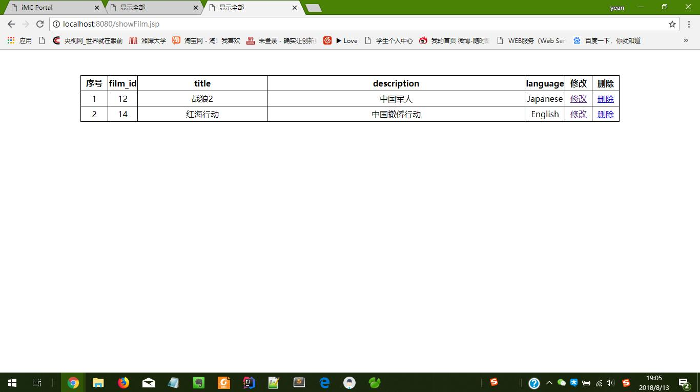

#### 项目运行
1. 项目使用的 Tomcat 8.0.36 作为运行服务器。       
2. 将项目添加到工作空间中，点击运行 Tomcat 运行。     

#### 项目文件结构    
1. com.dmh.dao 包下放的是对数据库操作的 java 代码。JDBCConnect 为连接数据库的配置文件加载和
创建数据库连接。以 *Table 结尾的是接口，对表操作的接口对象。impl 中以
*Impl 结尾的是 *Table 接口的实现类。      
2. com.dmh.entity 是 java 的简单的 java 对象。      
3. com.dmh.filter 为过滤器，有字符编码过滤器和限制非法使用过滤器。      
4. com.dmh.servlet  为 Servlet 类代码。              
5. com.dmh.test 为单元测试代码。(为什么将测试代码放在这里？因为自己在不熟悉 idea 的情况下将代码放到test 文件夹下运行出错，所以只能将代码放在这里测试。)       

#### 数据库信息
1. 账号为: root       
2. 密码为：1234      
3. 使用的数据库为：sakila        
4. 数据库配置信息放在 resources 文件夹下 db.properties.      

#### 运行截图   
1. 登录     
       
2. 首页    
       
3. 新增界面     
      
4. 显示电影
      
5. 修改信息
  
  
6. 删除    
  
  

#### gitHub 地址
**https://github.com/dmhAyt/Exam-19527-20180813-1.git**